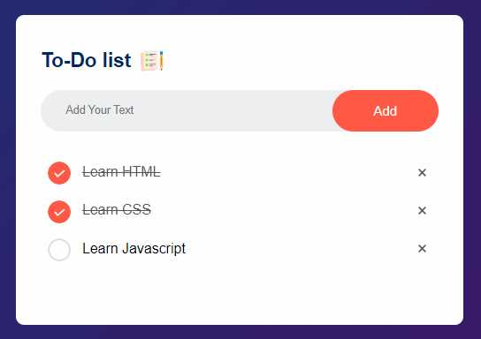

# ToDo-List-JS

This is to-do list using Javascript, in which you can add, delete, and marked task complete.

Another feature included in this project is when you refresh page, data will not be lost. 

Here are few techniques used in this project:
1. DOM Manipulation
2. Local Storage API
3. And many more...

Here is the screenshot of the application:

